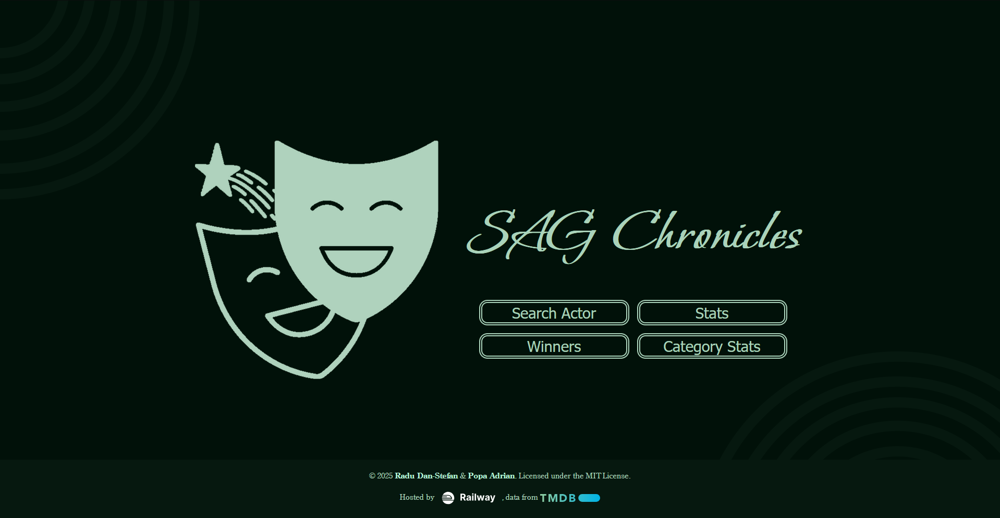

# Actor Awards Visualizer


A web application for visualizing and exploring data about actor awards, specifically focusing on the Screen Actors Guild Awards. This project provides various tools to search, filter, and analyze awards data, offering insights into winning actors, movies, and categories over the years.

## ✨ Features

*   **🏆 Winners Table:** A comprehensive, sortable, and filterable table of all award winners.
*   **🔍 Search:** Search for specific actors or movies to see their award history.
*   **📊 Category Statistics:** View detailed statistics and visualizations for each award category.
*   **🌟 Top Actors:** Discover the actors with the most awards.
*   **📰 News Integration:** Get the latest news related to the movie industry.
*   **Export Data:** Export filtered data in various formats like CSV, JSON, and XML.
*   **🔐 Admin Panel:** A dedicated interface for administrative tasks.

## 📸 Screenshots


_The main landing page with navigation to all features._


_The filterable and sortable winners table._


_The search interface for finding actors or movies._


_An example of the category statistics visualization._

## 🛠️ Tech Stack

*   **Backend:** Node.js
*   **Frontend:** HTML, CSS, Vanilla JavaScript
*   **Database:** SQLite

## 🚀 Getting Started

Follow these instructions to get a copy of the project up and running on your local machine for development and testing purposes.

### Prerequisites

You need to have Node.js and npm installed on your machine.

*   [Node.js](https://nodejs.org/) (which includes npm)

### Installation

1.  Clone the repository to your local machine:
    ```bash
    git clone https://github.com/Dan-works-on-stuff/ActorAwardsVisualizer.git
    ```
2.  Navigate to the project directory:
    ```bash
    cd ActorAwardsVisualizer
    ```
3.  Install the required npm packages:
    ```bash
    npm install
    ```
4.  Set up and populate the database by running the setup scripts:
    ```bash
    node src/data/setupDB.js
    node src/data/importData.js
    ```
5.  Start the server:
    ```bash
    npm run dev
    ```
6.  Open your browser and navigate to `http://localhost:3000` to see the application in action.

## 📂 Project Structure

```
ActorAwardsVisualizer/
├── public/              # All static frontend files (HTML, CSS, images)
├── src/                 # Backend source code
│   ├── controllers/     # Request handlers
│   ├── data/            # Database files, setup and import scripts
│   ├── models/          # Data interaction logic
│   ├── utils/           # Helper functions
│   └── routes.js        # API route definitions
├── server.js            # The main NoddeJS server entry point
└── package.json         # Project dependencies and scripts
```

## 👤 Author

*   **Dan-works-on-stuff** - [GitHub Profile](https://github.com/Dan-works-on-stuff)
*   **Popa Adrian** - [GitHub Profile](https://github.com/AdrianPopaRM)
